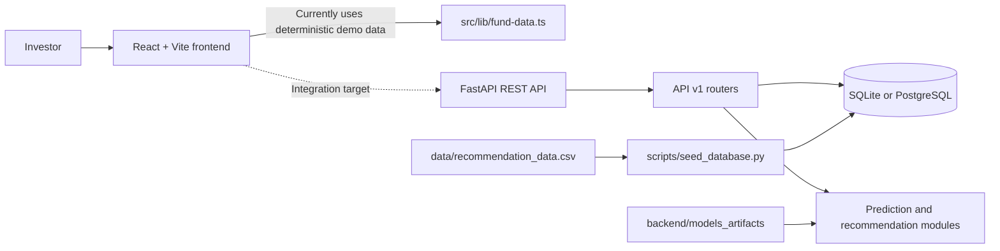

# FundIQ

FundIQ is an AI-assisted mutual-fund analytics platform for exploring Indian mutual-fund schemes, viewing risk and NAV analytics, generating suitability recommendations, and tracking a portfolio.

The repository contains:

- A React, TypeScript, Vite, and TanStack Start frontend.
- A FastAPI backend with SQLAlchemy, SQLite/PostgreSQL support, authentication, analytics, predictions, watchlist, portfolio, and recommendations APIs.
- A reproducible SQLite seed script and the data/model inputs used by the backend.

> **Disclaimer:** FundIQ is a software project for research and demonstration. Its predictions and recommendations are not financial advice.

## Architecture



### Runtime components

| Component | Location | Responsibility |
| --- | --- | --- |
| Frontend | `frontend/` | Dashboard, discovery, prediction, questionnaire, and portfolio UI. The current UI uses deterministic local data in `frontend/src/lib/fund-data.ts`. |
| Backend | `backend/app/` | FastAPI application and `/api/v1` routes for auth, schemes, analytics, predictions, recommendations, watchlist, and portfolio. |
| Seed pipeline | `scripts/seed_database.py` | Creates the SQLAlchemy tables and loads the included recommendation dataset into SQLite. |
| Source data | `data/` and `backend/data/` | CSV inputs used by the seed process and supporting analysis. |
| ML artifacts | `backend/models_artifacts/` | Small runtime model files loaded by the prediction system. |

## Quick Start

### Prerequisites

- Git
- Python 3.10 or newer
- Node.js 18 or newer and npm

### 1. Clone the repository

```bash
git clone https://github.com/Hari-Officia/FundIQ.git
cd FundIQ
```

### 2. Start the backend

Create a virtual environment, install dependencies, and seed the local SQLite database:

```bash
cd backend
python -m venv .venv
```

Windows PowerShell:

```powershell
.\.venv\Scripts\Activate.ps1
```

macOS/Linux:

```bash
source .venv/bin/activate
```

Install and seed from the `backend` directory:

```bash
python -m pip install --upgrade pip
python -m pip install -r requirements.txt
python ..\scripts\seed_database.py
python -m uvicorn app.main:app --host 127.0.0.1 --port 8000 --reload
```

On macOS/Linux, use `python ../scripts/seed_database.py` instead.

The backend reads `.env` when present and otherwise uses local SQLite defaults. Copy `backend/.env.example` to `backend/.env` only when you need to override those defaults. Never commit `.env` or a generated database.

### 3. Start the frontend

Open a second terminal at the repository root:

```bash
cd frontend
npm ci
npm run dev
```

Open the URL printed by Vite, normally `http://localhost:5173`.

## Service URLs

| Service | URL |
| --- | --- |
| Frontend | `http://localhost:5173` |
| Backend health | `http://127.0.0.1:8000/health` |
| Swagger API docs | `http://127.0.0.1:8000/docs` |
| OpenAPI JSON | `http://127.0.0.1:8000/api/v1/openapi.json` |

The backend root redirects to port 8080 for legacy deployments; use the frontend URL printed by Vite for local development.

## Docker Compose (optional)

Docker Compose starts the backend with PostgreSQL and Redis:

```bash
docker compose up --build
```

The backend is available at `http://127.0.0.1:8000`. The Compose database is empty on first start, so seed it after the services are running with a backend container command or use the local SQLite workflow above. The frontend is intentionally run separately with npm.

## Useful checks

```bash
# Frontend
cd frontend
npm run build
npm run lint

# Backend, from backend/ with the virtual environment active
python -m compileall app
```

## Repository hygiene

Tracked files include source code, lockfiles, documentation, datasets required by the seed process, and runtime ML artifacts. Local secrets, virtual environments, generated databases, frontend build output, dependency folders, archives, and large training-only files are ignored by Git.

## License

See [LICENSE](LICENSE).
