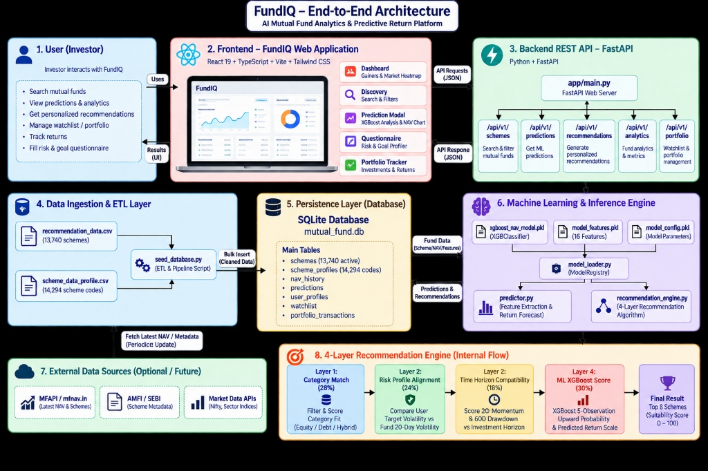
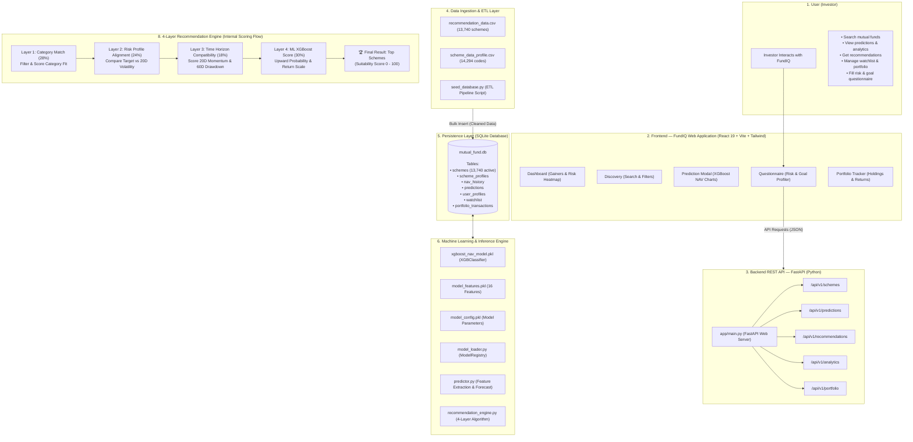

# 🚀 FundIQ — AI Mutual Fund Analytics & Predictive Platform

An enterprise-grade **AI Mutual Fund Analytics & 4-Layer Recommendation Web Application** for evaluating **13,740+ Indian Mutual Fund schemes**. Powered by **XGBoost Machine Learning NAV predictions**, **historical risk modeling**, a **4-Layer Hybrid Suitability Engine**, and a modern **React + Vite Glassmorphism Interface** with **Explainable AI (XAI)** rationale drivers.

---

## 🏗️ End-to-End System Architecture





---

## 🧩 Architectural Component Breakdown

### 1. **User Interaction Layer**
- Allows investors to perform multi-factor risk assessments, view short-term XGBoost NAV return predictions, track portfolios, and search 13,740+ Indian mutual fund schemes.

### 2. **Frontend Web Application (`FundIQ/frontend/`)**
- Built using **React 19**, **TypeScript**, **Vite**, **TanStack Router**, and **Tailwind CSS**.
- **Views**: Interactive Dashboard, Fund Discovery, Scheme Analytics Modal (Recharts NAV trends & MA20/MA60 overlays), Questionnaire Wizard, and Portfolio Tracker.

### 3. **Backend REST API (`FundIQ/backend/`)**
- High-performance Python **FastAPI** web server with modular routing:
  - `/api/v1/schemes`: Browse and search 13,740 schemes.
  - `/api/v1/predictions`: Fetch XGBoost 5-observation forward NAV return predictions.
  - `/api/v1/recommendations`: Execute 4-layer engine and persist recommendation logs.
  - `/api/v1/analytics`: Retrieve NAV historical volatility and risk metrics.
  - `/api/v1/portfolio`: Manage user watchlist and portfolio holdings.

### 4. **Data Ingestion & ETL Layer (`FundIQ/scripts/`)**
- Ingests raw time-series data from `recommendation_data.csv` (13,740 schemes) and scheme profiles.
- `seed_database.py` cleans missing attributes, calculates benchmark initial states, and bulk seeds SQLite database tables.

### 5. **Persistence Layer (`mutual_fund.db`)**
- **SQLite Relational Database** storing 12 ORM tables (`schemes`, `nav_history`, `predictions`, `user_profiles`, `recommendations`, `recommendation_items`, `watchlist`, `portfolio_transactions`).

### 6. **Machine Learning & Inference Engine (`FundIQ/backend/app/ml/`)**
- **Model Files**: `xgboost_nav_model.pkl`, `model_features.pkl` (16 feature vectors), `model_config.pkl`.
- **`model_loader.py`**: Model Registry loading models into memory at application startup.
- **`predictor.py`**: Feature vector extractor and 5-observation return predictor.
- **`recommendation_engine.py`**: Multi-factor scoring engine with AMC anti-clustering and variant deduplication.

### 7. **4-Layer Recommendation Scoring Formula**
$$\text{Final Score} = 0.28 \times \text{Category Match} + 0.24 \times \text{Risk Alignment} + 0.18 \times \text{Horizon Compatibility} + 0.30 \times \text{ML XGBoost Score}$$

---

## 🌟 Model Performance Highlights

- **Overall Directional Accuracy**: **75.37%** across 13,740 schemes
- **Debt Scheme Directional Accuracy**: **82.52%**
- **Feature Vector**: `ret_1d`, `ret_5d`, `ret_20d`, `ret_60d`, `vol_20d`, `vol_60d`, `momentum_20d`, `downside_vol_20d`, `drawdown_60d`, `price_vs_ma20`, `price_vs_ma60`.

---

## 🚀 Step-by-Step Instructions to Run the Project

### Prerequisites
- **Python**: 3.10 or higher
- **Node.js**: 18 or higher (with npm)

---

### Step 1: Start the FastAPI Backend Server

1. Open a terminal and navigate to the backend directory:
   ```bash
   cd FundIQ/backend
   ```

2. Install Python dependencies:
   ```bash
   pip install -r requirements.txt
   ```

3. Seed the SQLite Database with all 13,740 schemes:
   ```bash
   python ../scripts/seed_database.py
   ```

4. Start the FastAPI server using Uvicorn:
   ```bash
   python -m uvicorn app.main:app --host 127.0.0.1 --port 8000 --reload
   ```

---

### Step 2: Start the React Web Frontend

1. Open a second terminal window and navigate to the frontend directory:
   ```bash
   cd FundIQ/frontend
   ```

2. Install Node.js dependencies:
   ```bash
   npm install
   ```

3. Start the Vite development server:
   ```bash
   npm run dev
   ```

---

## 🌐 Application Access Points

| Service | URL | Description |
| :--- | :--- | :--- |
| 🚀 **Web Application UI** | **`http://localhost:8080`** (or `http://localhost:8000`) | Main React + Vite Glassmorphism Web App |
| ⚙️ **FastAPI Backend Server** | **`http://localhost:8000`** | REST API Server |
| 📖 **API Documentation** | **`http://localhost:8000/docs`** | Interactive Swagger API Docs |
| 🏥 **Health Check** | **`http://localhost:8000/health`** | System Health Verification Endpoint |

---

## 🔑 Demo Login Credentials

- **Email**: `user@example.com`
- **Password**: `Password123!`
